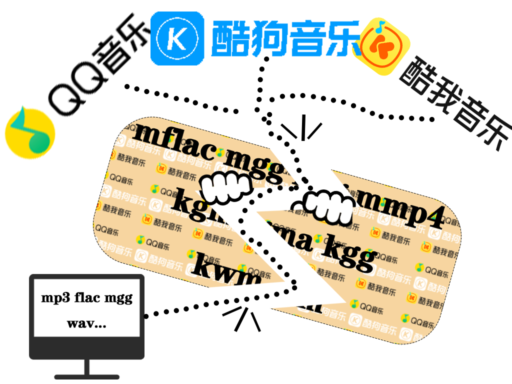

<div align="center">

# QKKDecrypt - QQ酷狗酷我音乐解密工具

</div>


<div align="center">


</div>

<div align="center">

**一款可以解密QQ音乐、酷我音乐、酷狗音乐的开源免费工具**<br>
**仅供学习交流使用，尊重正版，从你我做起**<br>
**如果对你有帮助，可以点一下star吗？万分感谢！！！**<br>
**禁止商用、禁止倒卖**

</div>

<div align="center">



</div>

---
# `QKKDecrypt` 介绍
- 中文名: `QQ酷狗酷我音乐解密工具`
- 英文名: `QKKDecrypt`
- 项目地址: `https://github.com/Acooldog/QQKWKG-TriMusicDecrypt`
  
main分支为console版本
main-ui分支为UI版本，UI框架为pyside6

qq音乐解密模型思路是[qqmusic_decrypt](https://github.com/luyikk/qqmusic_decrypt)项目提供的<br>
其他的解密模型均自主抱着学习以及尊重正版的名义逆向学习<br>
仅供学习交流使用，禁止商用！禁止倒卖！倒卖者将举报平台并持续追责！！！

## Branches

- `main`
  - 控制台版本
  - 薄入口 `main.py`
  - 三层架构: `Presentation / Application / Infrastructure`
  - 打包形态: `onefile`
- `main-ui`
  - PySide6 桌面 UI 版本
  - Win10 风格
  - 打包形态: `onedir + _internal + setup`

## Platform Support

- `QQ音乐`
  - 运行期解密
  - 需要 QQ 音乐保持运行
- `酷我音乐`
  - 运行期解密
  - 需要酷我保持运行
- `酷狗音乐`
  - 文件级离线解密
  - 不需要 KuGou 保持运行

## Architecture

根目录只保留薄 `main.py`。
核心代码统一位于 `src/`:
- `src/Presentation`
  - CLI
  - 控制台交互
  - `main-ui` 分支中的 PySide6 UI
- `src/Application`
  - 平台调度
  - 批处理编排
  - timing 聚合
  - 输出冲突处理
- `src/Infrastructure`
  - 平台适配器
  - 运行时路径
  - 配置仓储
  - 进程检测
  - 转码与内部资源定位

## CLI

```powershell
O:\A_python\A_QKKd\.venv\Scripts\python.exe O:\A_python\A_QKKd\main.py qq decrypt --input "D:\QQMusic" --output "O:\A_python\A_QKKd\output"
```

```powershell
O:\A_python\A_QKKd\.venv\Scripts\python.exe O:\A_python\A_QKKd\main.py kuwo decrypt --input "D:\Kuwo" --output "O:\A_python\A_QKKd\output"
```

```powershell
O:\A_python\A_QKKd\.venv\Scripts\python.exe O:\A_python\A_QKKd\main.py kugou decrypt --input "O:\KuGou\KugouMusic" --output "O:\A_python\A_QKKd\output"
```

## Interactive Console

```powershell
O:\A_python\A_QKKd\.venv\Scripts\python.exe O:\A_python\A_QKKd\main.py
```

交互模式会:
- 显示项目地址、QQ 和法律声明
- 询问是否直接使用配置
- 让用户选择平台
- 对 `QQ/酷我` 进行阻断式进程检测
- 所有退出路径统一经过 `按任意键退出`

## Configuration

外部配置文件: `plugins/plugins.json`
命名空间: `decrypt_cli`

关键字段:
- `shared.output_dir`
- `shared.cli_collision_policy`
- `shared.recursive`
- `qq.input_dir`
- `qq.format_rules`
- `qq.process_match`
- `kuwo.input_dir`
- `kuwo.process_name`
- `kuwo.exe_path`
- `kuwo.signature_file`
- `kuwo.format_kwm`
- `kugou.input_dir`
- `kugou.kgg_db_path`
- `kugou.key_file`
- `kugou.target_format_kgma`
- `kugou.target_format_kgg`

## Shared Output Policy

三平台共用一个输出根目录。
- CLI: 同名跨平台冲突时自动加平台后缀
  - `花海.qq.flac`
  - `花海.kuwo.mp3`
  - `花海.kugou.flac`
- 交互模式: 运行时询问用户处理方式

## Timing

三平台统一输出 timing:
- 单文件: `scan`, `dedupe`, `decrypt`, `transcode`, `publish`, `total`
- 批量: `batch_total`, `batch_avg`, `batch_hotspot`

## Transcoding

只允许调用内部资源中的 `assets/ffmpeg*.exe`。
- 禁止调用系统 `ffmpeg`
- `QQ` 保留源格式级规则
- `酷我` 使用 `format_kwm`
- `酷狗` 使用 `target_format_kgma / target_format_kgg`

## Packaging

```powershell
cd O:\A_python\A_QKKd
npm run package
```

打包行为:
- `main` 构建 `QKKDecrypt.exe` (`onefile`)
- `main-ui` 构建 `QKKDecrypt-UI-setup.exe`
- `release` 目录只保留本次新版本产物

运行时目录规则:
- 外部自动生成:
  - `plugins`
  - `_log`
  - `output`
- 内部:
  - 其他非自动生成代码与资源全部打入 onefile 或 `_internal`

## PySide6 Note

`main-ui` 分支采用 `PySide6`。PySide6 基于 Qt for Python，桌面界面由本地 Qt 窗口和 Python 业务逻辑直接驱动。UI 分支只替换 `Presentation` 层，不改业务核心层。

## Attribution

- `QQ 音乐` 解密模型思路参考项目：
  - [`qqmusic_decrypt`](https://github.com/luyikk/qqmusic_decrypt)
- 其他平台模型均为自主逆向学习实现，基于学习交流与尊重正版的目的整理。

## Compliance

- 仅供学习交流使用
- 请仅处理你本人拥有合法访问权限的本地文件
- 请遵守版权、平台协议与适用法律
- 禁止商用
- 禁止倒卖
- 倒卖者将举报平台并持续追责

## 许可证

本仓库中**由作者自行编写的源码部分**采用 [MIT 协议](LICENSE)。

但当前分发包**不是 MIT-only**。原因很直接：
- `main-ui` 使用 `PySide6 / Qt for Python`，其运行库适用 `LGPLv3 / GPLv3 / 商业许可` 体系
- 当前内置的 `FFmpeg` 为 GPL 构建，分发时不能简单按“纯 MIT 软件包”对外表述
- `QQ 音乐` 解密模型思路参考了 [`qqmusic_decrypt`](https://github.com/luyikk/qqmusic_decrypt)，该部分应按来源项目的许可证和归属情况单独审视，不能默认并入本项目的 MIT 再授权边界

更准确的工程表述是：
- **你的自有源码可以是 MIT**
- **当前分发包不是 MIT-only**

详细第三方许可证与风险点见：
- [THIRD_PARTY_LICENSES.md](THIRD_PARTY_LICENSES.md)

## 重要说明
本项目 `main-ui` 分支动态链接 `PySide6 / Qt` 运行库。用户可以自由替换对应共享库版本。
